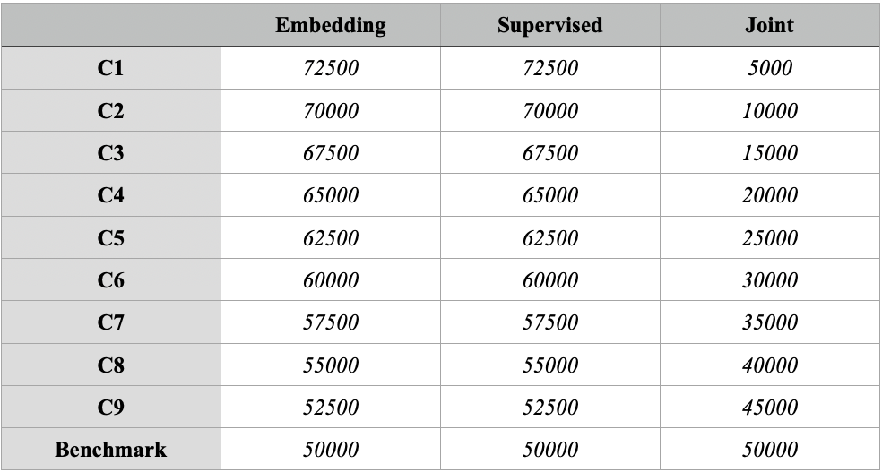

# Codebase for "Time Series Synthesis using Generative Adversarial Networks (TimeGAN)"

Author improvement and extensions: Jan Mark Dannenberg

Reference: Jan Mark Dannenberg, Lydia Y. Chen, Aditya Kunar, Zilong Zhao 
"Time Series Synthesis using Generative Adversarial Networks," 2021.

Paper Link: http://resolver.tudelft.nl/uuid:fe2e735d-35fa-4787-9a28-bfbf3a276146

Original code base authors: Jinsung Yoon, Daniel Jarrett, Mihaela van der Schaar

Reference: Jinsung Yoon, Daniel Jarrett, Mihaela van der Schaar, 
"Time-series Generative Adversarial Networks," 
Neural Information Processing Systems (NeurIPS), 2019.
 
Paper Link: https://papers.nips.cc/paper/8789-time-series-generative-adversarial-networks

Contact: j.m.dannenberg@student.tudelft.nl

This directory contains different Tensorflow implementations of TimeGAN framework for synthetic time-series data generation
using one synthetic dataset and two real-world datasets (found in data directory).

-   Sine data: Synthetic
-   Stock data: https://finance.yahoo.com/quote/GOOG/history?p=GOOG
-   Energy data: http://archive.ics.uci.edu/ml/datasets/Appliances+energy+prediction

For the first 2 implementations mentioned below the proposed improvement of paper (http://resolver.tudelft.nl/uuid:fe2e735d-35fa-4787-9a28-bfbf3a276146) to TimeGAN is implemented.

This directory contains three different approaches to implementing TimeGAN. In addition, we also included the
scripts used for analyzing discriminative & predictive scores (analyze_metrics.py) and doing linear regression on results
of the re-weighting improvement. The first one might need to be adapted depending on which implementation is used, currently it is set for implementation (3).

### (1) Original (fixed) implementation 
This is the original implementation by the authors of TimeGAN
, reverted to Tensorflow 1 after an incorrect accepted pull request. This implementation can be found
  in alternative_approaches/timegan-tfv1 and needs the requirements from alternative_approaches/timegan-tfv1/requirements.txt to run.

#### Components

(1) data_loading.py
- Transform raw time-series data to preprocessed time-series data
- Generate sine data

(2) Metrics directory
  - visualization_metrics.py: PCA and t-SNE analysis between Original data and Synthetic data
  - discriminative_metrics.py: Use Post-hoc RNN to classify Original data and Synthetic data
  - predictive_metrics.py: Use Post-hoc RNN to predict one-step ahead

(3) timegan.py
- Use original time-series data as training set to generate synthetic time-series data

(4) experiment_tfv1.py
- Execution script for training TimeGAN, generating synthetic data and reporting the metrics.

(5) utils.py
- Some utility functions for metrics and timeGAN.

#### Command inputs (experiment_tfv1.py)

-   data_name: sine, stock, or energy
-   seq_len: sequence length
-   module: gru, lstm, or lstmLN
-   hidden_dim: hidden dimensions
-   num_layers: number of layers
-   batch_size: the number of samples in each batch
-   metric_iterations: number of iterations for metric computation
-   joint_iteration: number of iterations for joint phase
-   supervised_iteration: number of iterations for supervised phase
-   embedding_iteration: number of iterations for embedding phase

#### Outputs

-   ori_data: original data
-   generated_data: generated synthetic data
-   metric_results: discriminative and predictive scores
-   visualization: PCA and tSNE analysis
-   losses: plots of all losses 
-   times: time metrics for each phase and in total

The outputs are exported to the 'results' directory (which should be at the level you run this)
and this directory should contain a 'metrics' and 'visualization' directory.

#### Example command

```shell
$ python3 experiment_tfv1.py --data_name stock --seq_len 24 --module gru --num_layer 3 
--hidden_dim 24 --iteration_embedding 60000 --iteration_supervised 60000 
--iteration_joint 30000 --batch_size 128 --metric_iteration 10
```

### (2) Updated Tensorflow 2 implementation 
This is the correctly updated to Tensorflow 2 implementation of TimeGAN. This implementation can be found
at the source of this project and needs the requirements from requirements.txt to run.

#### Components

(1) data_loading.py
- Transform raw time-series data to preprocessed time-series data
- Generate sine data

(2) Metrics directory
  - visualization_metrics.py: PCA and t-SNE analysis between Original data and Synthetic data
  - discriminative_metrics.py: Use Post-hoc RNN to classify Original data and Synthetic data
  - predictive_metrics.py: Use Post-hoc RNN to predict one-step ahead

(3) timegan.py
- Use original time-series data as training set to generate synthetic time-series data

(4) experiment.py
- Execution script for training TimeGAN, generating synthetic data and reporting the metrics.

(5) utils.py
- Some utility functions for metrics and timeGAN.

#### Command inputs (experiment_tfv1.py)

-   data_name: sine, stock, or energy
-   seq_len: sequence length
-   module: gru, lstm, or lstmLN
-   hidden_dim: hidden dimensions
-   num_layers: number of layers
-   batch_size: the number of samples in each batch
-   metric_iterations: number of iterations for metric computation
-   joint_iteration: number of iterations for joint phase
-   supervised_iteration: number of iterations for supervised phase
-   embedding_iteration: number of iterations for embedding phase

#### Outputs

-   ori_data: original data
-   generated_data: generated synthetic data
-   metric_results: discriminative and predictive scores
-   visualization: PCA and tSNE analysis
-   losses: plots of all losses 
-   times: time metrics for each phase and in total

The outputs are exported to the 'results' directory (which should be at the level you run this)
and this directory should contain a 'metrics' and 'visualization' directory.

#### Example command

```shell
$ python3 experiment_tfv1.py --data_name stock --seq_len 24 --module gru --num_layer 3 
--hidden_dim 24 --iteration_embedding 60000 --iteration_supervised 60000 
--iteration_joint 30000 --batch_size 128 --metric_iteration 10
```

### (3) YData implementation 
This implementation of TimeGAN is from YData (https://github.com/ydataai/ydata-synthetic) and slighly adapted and can be found in
alternative_approaches/timegan_ydata. This implementation is centered around an optimised for the stock data set.
It needs the requirements from requirements.txt at the source of this project to run. 

#### Components

(1) data_loading.py
- Transform raw time-series data to preprocessed time-series data
- Generate sine data

(2) Metrics directory
  - visualization_metrics.py: PCA and t-SNE analysis between Original data and Synthetic data
  - discriminative_metrics.py: Use Post-hoc RNN to classify Original data and Synthetic data
  - predictive_metrics.py: Use Post-hoc RNN to predict one-step ahead

(3) timegan.py
- Use original time-series data as training set to generate synthetic time-series data

(4) experiment_ydata.py (source of project)
- Execution script for training TimeGAN, generating synthetic data and reporting the metrics.

(5) utils.py
- Some utility functions for metrics and timeGAN.

#### Command inputs (experiment_tfv1.py)

-   data_name: sine, stock, or energy
-   seq_len: sequence length
-   module: gru, lstm, or lstmLN
-   hidden_dim: hidden dimensions
-   num_layers: number of layers
-   batch_size: the number of samples in each batch
-   metric_iterations: number of iterations for metric computation
-   iteration: number of iterations
-   save_itt: saving the model weights after each number of iterations
-   scale_train: scale the iterations of the first two phases with respect to this factor
-   trained_model: already trained model input (.pkl extension)

#### Outputs

-   ori_data: original data
-   generated_data: generated synthetic data
-   metric_results: discriminative and predictive scores
-   visualization: PCA and tSNE analysis
-   model: the trained model as a .pkl file

The outputs are exported to the 'results' directory (which should be at the level you run this)
and this directory should contain a 'metrics', 'model and 'visualization' directory.

#### Example command

```shell
$ python3 experiment_ydata.py --data_name stock --seq_len 24 --module gru --num_layer 3 
--hidden_dim 24 --iteration 25000 --scale_train 2 --batch_size 128 --metric_iteration 10
```

### Hyper parameters

For the research these parameters are relevant to reproduce the results from Table 1 & 2 for the following data sets.

#### Sine (implementations 1 & 2)

-   data_name: sine
-   seq_len: 24
-   module: gru
-   hidden_dim: 24
-   num_layers: 3
-   batch_size: 128
-   metric_iterations: 10
-   joint_iteration: 50000
-   supervised_iteration: 50000
-   embedding_iteration: 50000

#### Stock (implementations 1, 2 & 3)

-   data_name: stock
-   seq_len: 24
-   module: gru
-   hidden_dim: 24
-   num_layers: 3
-   batch_size: 128
-   metric_iterations: 10

#### Stock (implementations 1, 2)

-   joint_iteration: 50000
-   supervised_iteration: 50000
-   embedding_iteration: 50000

#### Stock (implementation 3)

-   iteration: 50000

#### Energy (implementations 1 & 2)

-   data_name: energy
-   seq_len: 24
-   module: gru
-   hidden_dim: 24
-   num_layers: 6
-   batch_size: 128
-   metric_iterations: 10
-   joint_iteration: 50000
-   supervised_iteration: 50000
-   embedding_iteration: 50000

To test and evaluate the proposed improvement of scaling the iterations over different training phases (section 5.2) we used the configurations found in the figure below
for respectively embedding_iteration, supervised_iteration and joint_iteration.
All other hyper parameters remain the same for the data sets given above.


